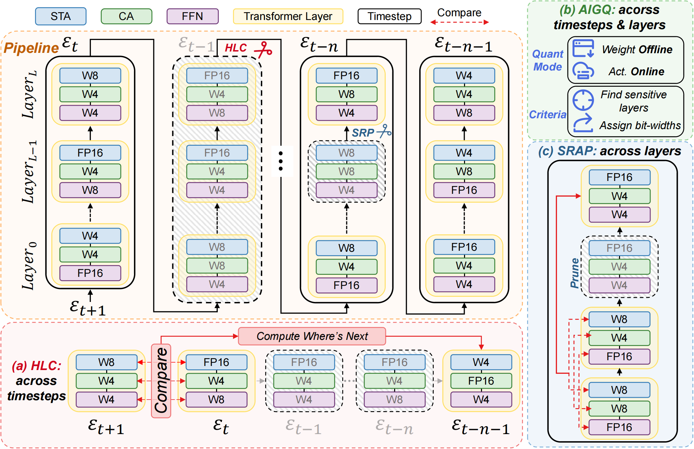
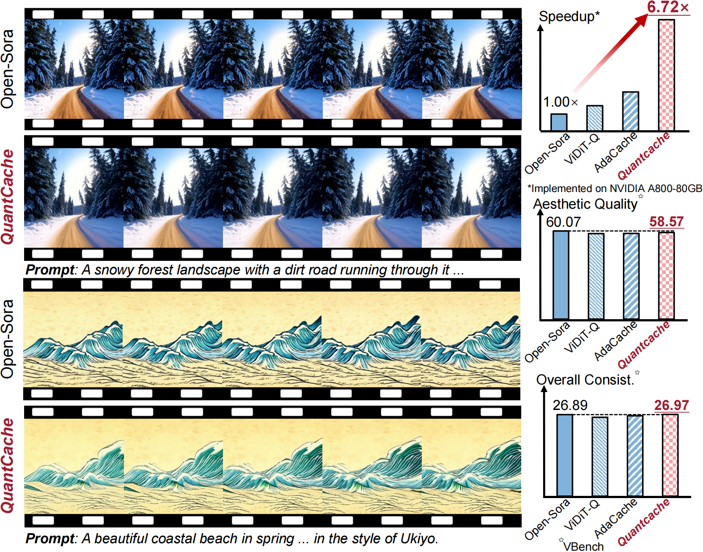
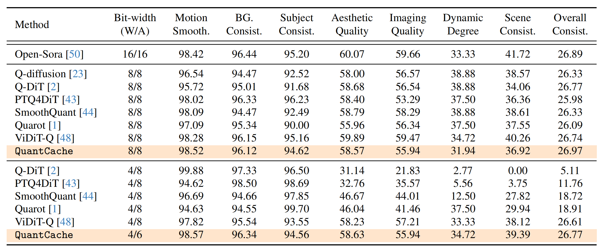
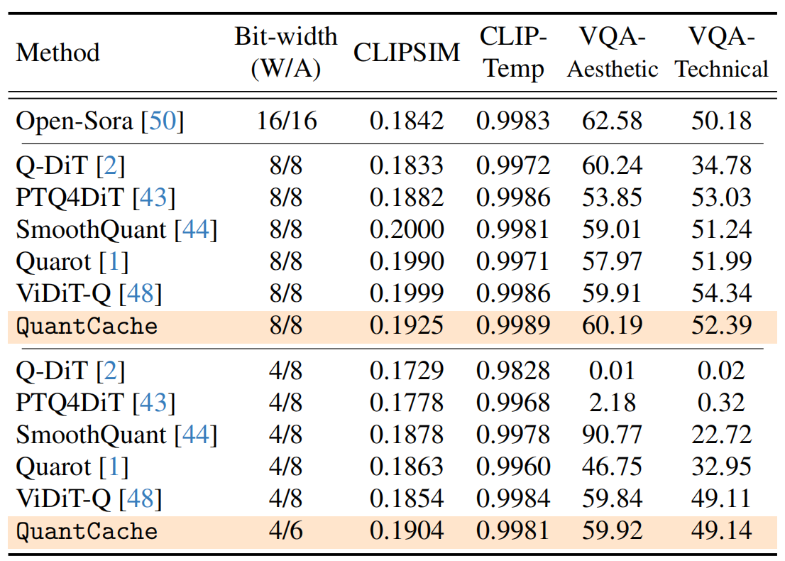
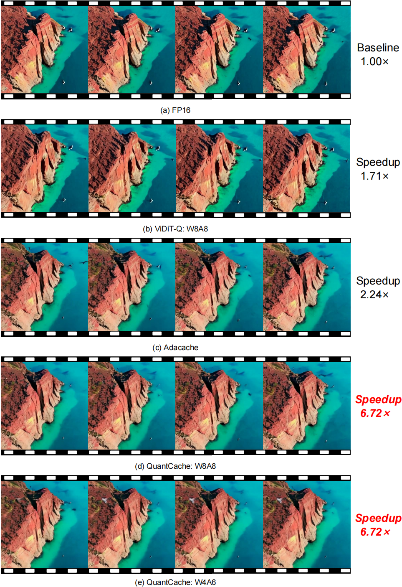
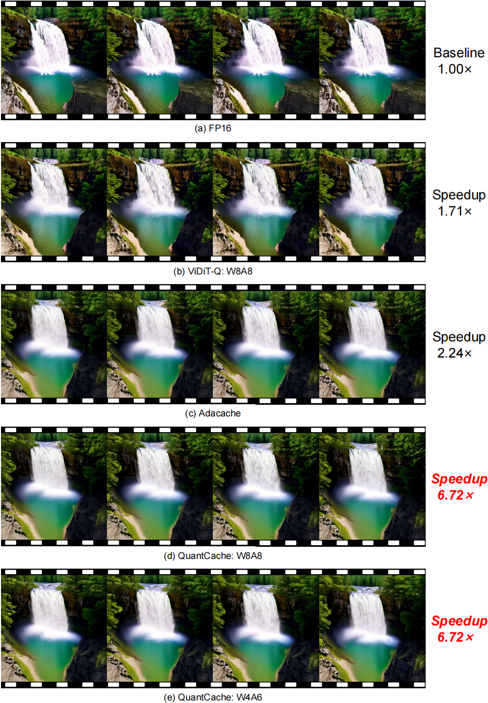
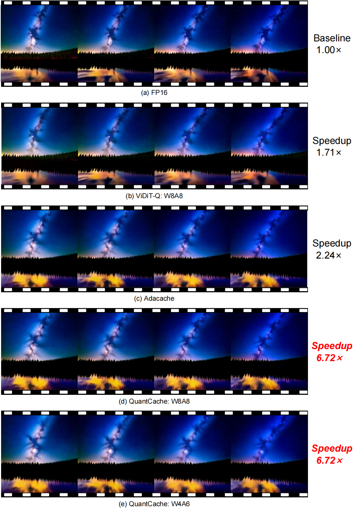

# QuantCache：Adaptive Importance-Guided Quantization with Hierarchical Latent and Layer Caching for Video Generation

Junyi Wu, [Zhiteng Li](https://zhitengli.github.io), [Zheng Hui](https://zheng222.github.io/), [Yulun Zhang](http://yulunzhang.com/), [Linghe Kong](https://www.cs.sjtu.edu.cn/~linghe.kong/) and [Xiaokang Yang](https://scholar.google.com/citations?user=yDEavdMAAAAJ)

[[arXiv](
)] [[supplementary material]()]


#### 🔥🔥🔥 News

- **2025-03-09:** This repo is released.

---

> **Abstract:** Recently, Diffusion Transformers (DiTs) have emerged as a dominant architecture in video generation, surpassing U-Net-based models in terms of performance. However, the enhanced capabilities of DiTs come with significant drawbacks, including increased computational and memory costs, which hinder their deployment on resource-constrained devices. Current acceleration techniques, such as quantization and cache mechanism, offer limited speedup and are often applied in isolation, failing to fully address the complexities of DiT architectures. In this paper, we propose QuantCache, a novel training-free inference acceleration framework that jointly optimizes hierarchical latent caching, adaptive importance-guided quantization, and structural redundancy-aware pruning. QuantCache achieves an end-to-end latency speedup of 6.72× on Open-Sora with minimal loss in generation quality. Extensive experiments across multiple video generation benchmarks demonstrate the effectiveness of our method, setting a new standard for efficient DiT inference. The code and models will be available at https://github.com/JunyiWuCode/QuantCache.


---

## ⚒️ TODO
 
* [ ] Complete this repository

## 🔗 Contents

- [X] [Results](#results)
- [ ] [Citation](#citation)
- [ ] [Acknowledgements](#-acknowledgements)


# <a name="results"></a>🔎 Results

We achieved an end-to-end latency speedup of 6.72× with negligible quality degradation, compared with Open-Sora 1.2. 

Detailed results can be found in the paper.

<details>
<summary>&ensp;Quantitative Comparisons (click to expand) </summary>
<li> Performance comparison of various methods on VBench, Table 1 from the main paper. 
 
<p align="center">

</p>
</li>
<li> Performance comparison of various methods on CLIP and Dover, Table 2 from the main paper. 
<p align="center">

</p>
</li>
</details>

<details open>
<summary>&ensp;Visual Comparisons (click to expand) </summary>

|FP16|QuantCache W8A8|QuantCache W4A6|
|---|---|---|
|[]()|[]()|[]()|
|[]()|[]()|[]()|
|[]()|[]()|[]()|
|[]()|[]()|[]()|


</details>

<details open>
<summary>&ensp;More Comparisons across Different Methods (click to expand) </summary>
<p align="center">

</p>
 
---
 
<p align="center">

</p>

---

<p align="center">

</p>


</details>


## Citation

If you find the code helpful in your research or work, please cite the following paper.

```
@article{wu2025quantcacheadaptiveimportanceguidedquantization,
  title={QuantCache: Adaptive Importance-Guided Quantization with Hierarchical Latent and Layer Caching for Video Generation},
  author={Wu, Junyi and Li, Zhiteng and Hui, Zheng and Zhang, Yulun and Kong, Linghe and Yang, Xiaokang},
  journal={arXiv preprint arXiv:2503.06545},
  year={2025}
}
```

## 💡 Acknowledgements

This work is released under the Apache 2.0 license.


